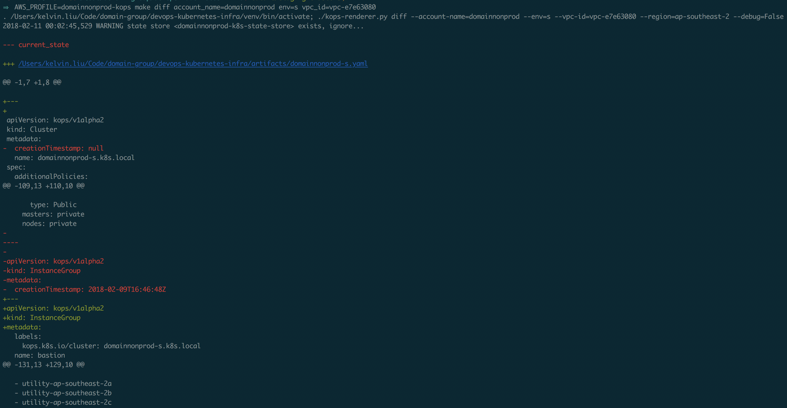

# Kubernetes


## Create and manage K8S cluster using templates in an automated way ^.^

----

> <https://github.com/kubernetes/kops/blob/master/docs/cluster_spec.md>

### Requirements

----

* [kops](https://github.com/kubernetes/kops/)
* python3.6

### Installation

----

#### from pypi

----

```bash
pip install kforce
```

#### from source

----

```bash
git clone https://github.com/ycliuhw/kforce.git
cd kforce

virtualenv -p $(which python3.6) venv
source venv/bin/activate
python setup.py install
```

### Usage

----

#### create `kops` iam group, attach related policies, create user then add user to group:

```bash
AWS_PROFILE=[admin] make ensure_iam
```

#### create access key for `kops` user

```bash
AWS_PROFILE=[admin] make create_access_key
```

#### initialize templates dirs for a new cluster

```bash
AWS_PROFILE=[kops] kforce initialize --account-name=[aws-account1] --env=[s|p|u|m] --vpc-id=vpc-xxxx [--force=True]
```

#### build kops template

```bash
AWS_PROFILE=[kops] kforce build --account-name=[aws-account1] --env=[s|p|u|m] --vpc-id=vpc-xxxx
```

#### diff kops template

```bash
AWS_PROFILE=[kops] kforce diff --account-name=[aws-account1] --env=[s|p|u|m] --vpc-id=vpc-xxxx
```



#### apply kops template to create the cluster

```bash
AWS_PROFILE=[kops] kforce apply --account-name=[aws-account1] --env=[s|p|u|m] --vpc-id=vpc-xxxx
```

### directory structure

----

```text
├── Makefile
├── README.md
├── addons  # some required pre-installed addon packages (monitoring, logging, helm server - tiller etc.)
│   ├── README.md
│   └── cluster_role.yaml
├── __generated__  # WARNING: supposed for version control auto-generated templates(`GitOps` -> version controlled infra), DO NOT make any changes here
│   ├── README.md
│   ├── cre-m.yaml
│   ├── aws-account1-s.yaml
│   └── domainsandbox-s.yaml
├── bin
│   └── kforce
├── kforce
│   ├── aws_facts.py
│   ├── renderer.py
│   └── utils.py
├── requirements.txt
├── setup.cfg
├── templates  # cluster global definition
│   ├── cluster.yaml  # template
│   ├── values.yaml.j2  # configure
│   └── addons
│       ├── README.md
│       ├── autoscaler.yaml
│       ├── dashboard.yaml
│       ├── external-dns.yaml
│       ├── fluentd.yaml
│       ├── ingress-nginx-external.yaml
│       └── ingress-nginx-internal.yaml
└── vars  # new cluster configure customization goes here
    ├── aws-account2
    │   └── m.yaml
    ├── aws-account1
    │   ├── m-addons
    │   │   ├── grafama.yaml
    │   │   ├── influxdb.yaml
    │   │   ├── jenkins.yaml
    │   │   └── prometheus.yaml
    │   ├── s.yaml  # IMPORTANT: `aws-account1-[s]taging` cluster configure - naming convention ([env].yaml)
    │   ├── s-snippets  # IMPORTANT: any additional `instance group` defines here(high memory, spot, etc.)
    │   │   └── ig-spot.yaml  # spot instance group definition
    │   │   └── ig-high-memory.yaml  # high memory instance group definition
    │   ├── u.yaml  # `aws-account1-[u]at` cluster with standard 3*node IG and spot IG
    │   ├── u-snippets
    │   │   └── ig-spot.yaml
    │   └── m.yaml  # `aws-account1-[m]anagement` cluster with standard 3*node IG
    └── aws-account3
        └── s.yaml
```
